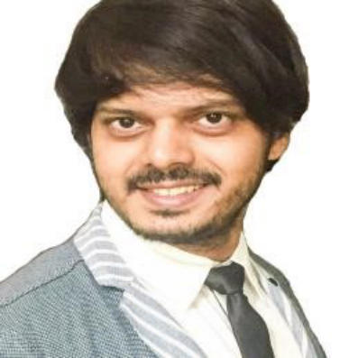

# Our Team

<table>
  <thead>
    <tr>
      <th style="text-align:left"></th>
      <th style="text-align:left"><b></b>
      </th>
    </tr>
  </thead>
  <tbody>
    <tr>
      <td style="text-align:left">
        

        

          
        

      </td>
      <td style="text-align:left">
        
<b>Felipe A. Millacura.</b> Biotechnology Engineer with experience in Research
          and Development. Semi-finalist within Youth action 2014 organized by the
          International Youth Foundation. Always involved in social causes related
          to children, poverty, cancer research and education. Cryptocurrency trader
          and investor. Spanish & English speaker.

        

      </td>
    </tr>
    <tr>
      <td style="text-align:left">
        
      </td>
      <td style="text-align:left"><b>Maria Victoria Del Castillo.</b> English teacher with more than 6 years
        of experience teaching children, adults, vulnerable students and with special
        needs. Always involved in social causes related to children, poverty and
        education. Cryptocurrency investor. Spanish & English speaker.</td>
    </tr>
    <tr>
      <td style="text-align:left">
        

        

          
        

      </td>
      <td style="text-align:left"><b>David Guzman </b>Civil Engineer in Informatics with more than 20 years
        of experience in both Back-end and Front-end development, with additional
        IT and communication experience at corporative level in diverse areas (Mining,
        Construction, Electricity, Automotive); with clear skill and high orientation
        in planning, organization, direction and problem control.</td>
    </tr>
    <tr>
      <td style="text-align:left">
        
      </td>
      <td style="text-align:left"><b>Juan Cuevas.</b> Informatics Engineer & Software developer with vast
        experience in Talend, Datastage, Laravel, C+, Python, Javascript among
        others. Involved in social causes related to children, poverty and education.
        Cryptocurrency investor Spanish speaker.</td>
    </tr>
    <tr>
      <td style="text-align:left">
        
      </td>
      <td style="text-align:left"><b>Yiyu Xiang.</b> Synthetic Biologist in genetic logic circuits. Cryptocurrency
        trader and investor interested in technical analysis and algorithmic trading.
        Aspiring creative writer. English and Mandarin Chinese speaker.</td>
    </tr>
    <tr>
      <td style="text-align:left">
        
      </td>
      <td style="text-align:left"><b>Prabu Sivasubramaniam.</b> Graduate in Bioengineering with focus on
        systems approach to biology. Experience in developing software for financial
        institutes as well as the science community. Speciality in high performance
        computing. Currently, pursuing interests in biotech and synthetic biology.
        English speaker.</td>
    </tr>
    <tr>
      <td style="text-align:left">
        

        

          
        

      </td>
      <td style="text-align:left"><b>Iulian Hanganu.</b> Foundation degree in Marketing & Commerce. Rumanian,
        Spanish & English speaker</td>
    </tr>
    <tr>
      <td style="text-align:left">
        

        

          
        

      </td>
      <td style="text-align:left"><b>Prateek Patil.</b> IT Security Professional with experience in information
        security management system (ISMS). Certified ISO27001 auditor. Hindi &
        English speaker</td>
    </tr>
    <tr>
      <td style="text-align:left">
        

        

          
        

      </td>
      <td style="text-align:left"><b>Mauricio Estephan.</b> Crypto enthusiast <b>s</b>ocial manager. Spanish,
        English & Arabic speaker.</td>
    </tr>
  </tbody>
</table>